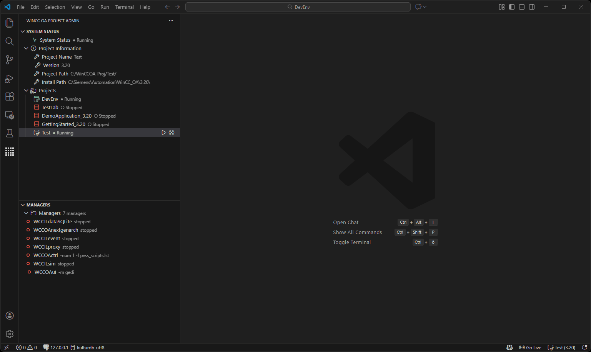

# WinCC OA Project Admin

**Project management and control for WinCC OA in Visual Studio Code**

[Features](#-features) • [Installation](#-installation) • [Known Issues](#-known-issues)

---

> **Disclaimer:**
> This is the first stable release (v1.0.4) of the WinCC OA Project Admin extension. Not all features are fully implemented and some functions may not work perfectly yet. Please report any issues you encounter.

---

## 🎬 See It In Action

---

## ✨ Features

### 🔍 Automatic Project Detection
- List all runnable Projects
- Detects WinCC OA version from installation
- Finds subprojects automatically

### 🎯 Project Management
- **Status Bar UI**: Click to switch between projects
- **Quick Pick Menu**: Browse all available WinCC OA projects in workspace
- **Auto-Selection**: Automatically selects first project on startup
- **Context Menu Actions**: Set active project, add to workspace, open in explorer

### ⚙️ Manager Control (PMON)
- Start/stop WinCC OA projects via PMON
- Automatic manager detection and control
- Proper startup/shutdown sequence (PMON → Managers)
- Real-time status updates

---

## ⚙️ Configuration

### Logging (for debugging)

| Setting | Default | Description |
|---------|---------|-------------|
| `winccoa.core.logLevel` | `INFO` | Log verbosity: `ERROR`, `WARN`, `INFO`, `DEBUG`, `TRACE` |

💡 **Tip**: Set log level to `DEBUG` when reporting bugs for detailed diagnostics.

---

## 🐛 Known Issues

### Current Limitations

1. **Project Switching**:
   - May require VS Code reload in some cases
   - Especially when switching between projects with different WinCC OA versions

2. **Multi-root Workspaces**:
   - Limited support for multiple WinCC OA projects simultaneously
   - Recommended: Use single project per workspace

3. **PMON Control**:
   - Requires WinCC OA to be properly installed and configured
   - PATH environment variable must include WinCC OA binaries
   - Some manager types may not be detected automatically

4. **Add New Manager:**
   - did not work correctly. 

### Reporting Bugs

Found an issue? Please report it with:
- WinCC OA version
- Extension version (`1.0.0`)
- Steps to reproduce the issue
- Enable `DEBUG` logging and attach log output

[Report Issue on GitHub](https://github.com/winccoa-tools-pack/vscode-winccoa-control/issues)

---

## 📝 Commands

Access via `Ctrl+Shift+P`:

| Command | Description |
|---------|-------------|
| `WinCC OA: Select Project` | Choose active project from list |
| `WinCC OA: Refresh Projects` | Re-scan workspace for projects |
| `WinCC OA: Start Project (PMON)` | Start WinCC OA project |
| `WinCC OA: Stop Project (PMON)` | Stop WinCC OA project |

---

## 🛠️ Requirements

- **VS Code:** 1.107.1 or higher
- **WinCC OA:** 3.19+ installed on your system

---

## 📄 License

This project is licensed under the MIT License - see the [LICENSE](LICENSE) file for details.

---

## 🔗 Related Extensions

This core library is used by:
- [WinCC OA Script Actions](https://marketplace.visualstudio.com/items?itemName=RichardJanisch.winccoa-script-actions) - Execute CTRL scripts
- [WinCC OA Test Explorer](https://marketplace.visualstudio.com/items?itemName=RichardJanisch.winccoa-vscode-tests) - Run unit tests
- [WinCC OA CTRL Language](https://marketplace.visualstudio.com/items?itemName=mPokornyETM.wincc-oa-ctrl-lang) - Language support
- [WinCC OA LogViewer](https://marketplace.visualstudio.com/items?itemName=RichardJanisch.winccoa-logviewer) - View log files

---

## ⚠️ Disclaimer

**WinCC OA** and **Siemens** are trademarks of Siemens AG. This project is not affiliated with, endorsed by, or sponsored by Siemens AG. This is a community-driven open source project created to enhance the development experience for WinCC OA developers.

---

Made with ❤️ for the WinCC OA community

[GitHub](https://github.com/winccoa-tools-pack/vscode-winccoa-control) • [Issues](https://github.com/winccoa-tools-pack/vscode-winccoa-control/issues) • [WinCC OA Docs](https://www.winccoa.com)

